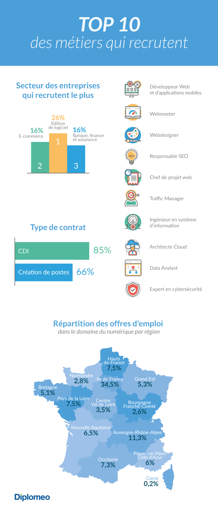

# Les métiers qui recrutent

*  🔖 **Top 10**

___

## 📑 Top 10

> C’est un secteur qui n’a pas été impacté par la crise sanitaire liée au Covid-19. 

Le secteur de l’informatique embauche beaucoup, les entreprises françaises sont nombreuses à rechercher de nouveaux professionnels qualifiés pour répondre aux évolutions technologiques et numériques - Source diplomeo 2021.

### 🏷️ **Hiérarchie**

Par conséquent observons la fiche métiers de ceux qui sont le plus demandé afin de cibler les compétences requises et leur intéractions.

