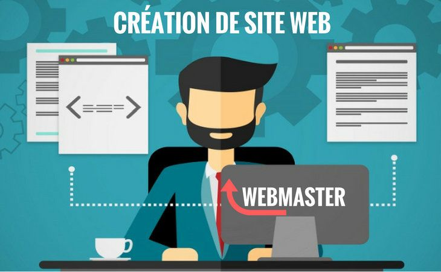
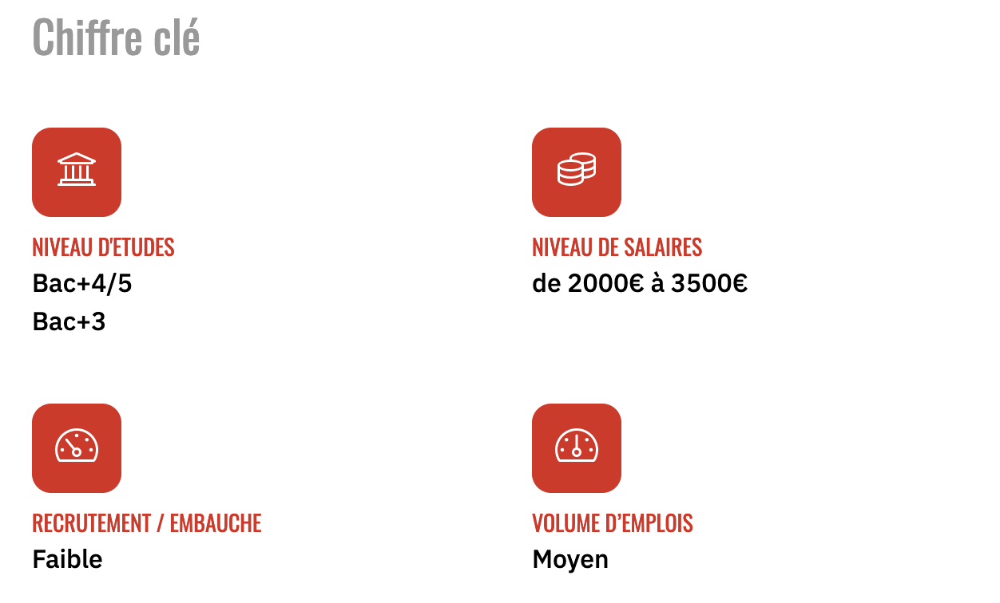
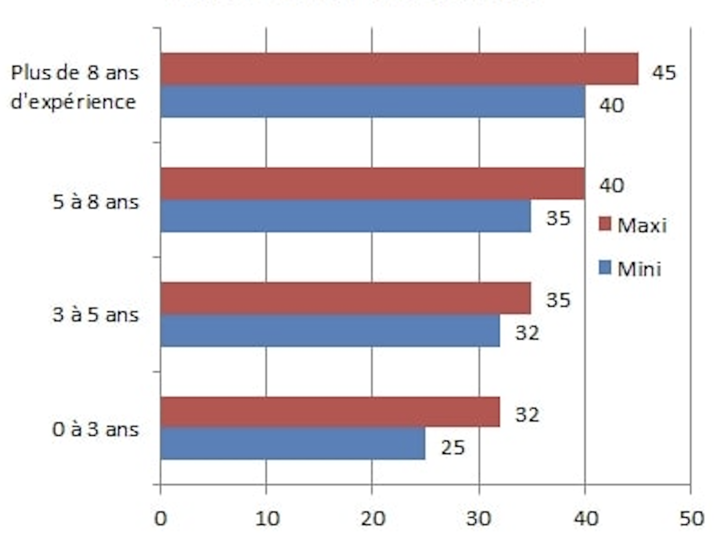

# Web Master

*  🔖 **Définition**
*  🔖 **Le métier**
*  🔖 **Les compétences**

___

## 📑 Définition

Le webmaster est le gestionnaire d’un site internet : il est en charge de son bon fonctionnement au quotidien.

Il doit avoir des compétences techniques pointues, mais aussi des compétences rédactionnelles (qui peuvent lui servir à écrire ou modifier des contenus par exemple). Parfois, c’est même au webmaster que revient la conception initiale du site internet (une bonne connaissance des langages informatiques est alors indispensable).

Il passe le plus clair de son temps à repérer les problèmes et à trouver des solutions, à apporter des modifications pour faire évoluer le site internet ou encore à l’animer pour attirer les internautes.

### 🏷️ **Contexte**

> D’après le site freelance-info

43% des freelances Webmaster réalisent leurs missions sous le statut de la microentreprise. 

73% des freelances accèdent à des missions directement chez des clients finaux, sans passer par un intermédiaire. 

___

## 📑 Le métier

À l'université ou en école spécialisée, plusieurs diplômes permettent d’accéder au métier de web master.

Formation classique en informatique, diplôme d'école de commerce complété par une formation spécialisée, école privée… Dans tous les cas, une adaptation permanente aux nouveaux outils est indispensable.

### 🏷️ **Salaires**

Ci-dessous, retrouvez les salaires moyens des webmasters en France

___

## 📑 Les compétences

Le webmaster se doit posséder polyvalence, créativité pour identifier les solutions techniques appropriées et gérer à la fois les problématiques techniques et éditoriales...

* Notions sur les langages: Javascript, HTML, CSS, PHP, XML, ASP...

* Notions SEO, webmarketing/webdesign : 

* Maîtrise PAO: Illustrator, Photoshop, Dreamweaver...

* Utilisation parfaite de la langue utilisée sur le site.
