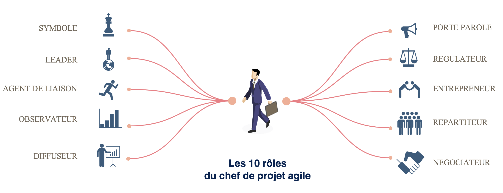
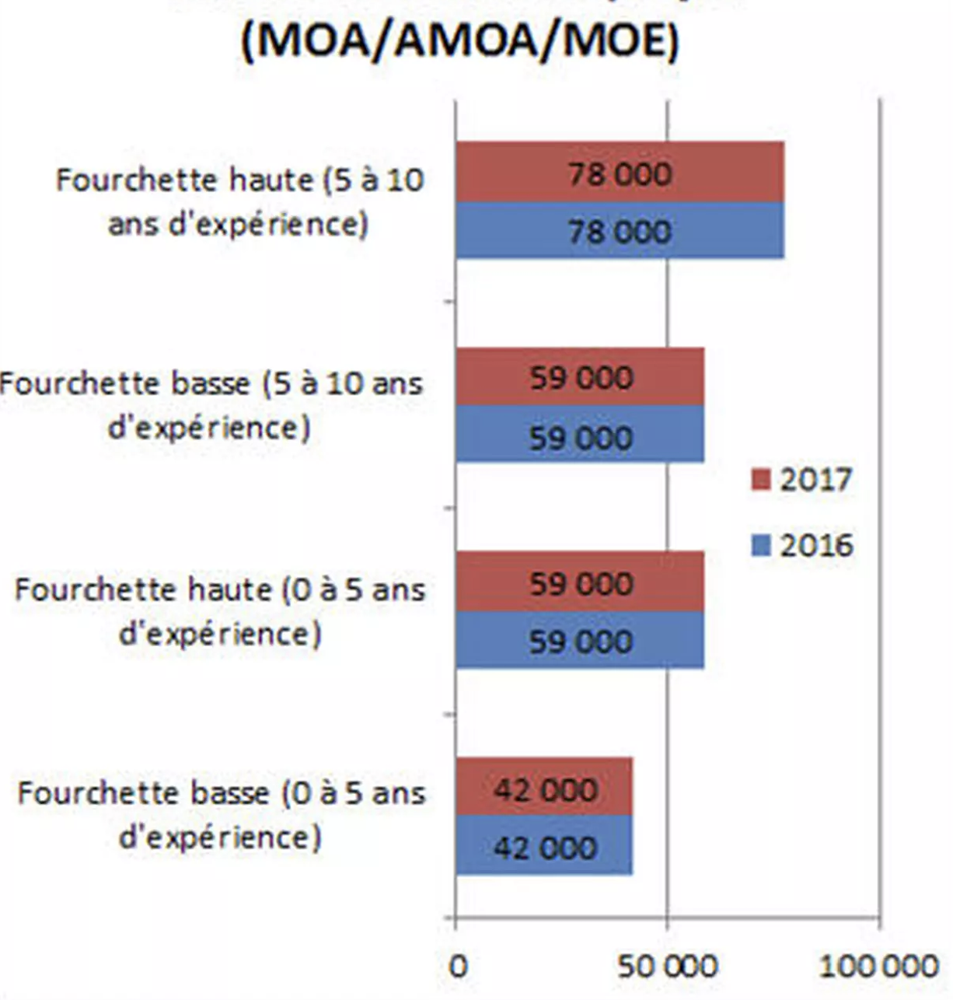
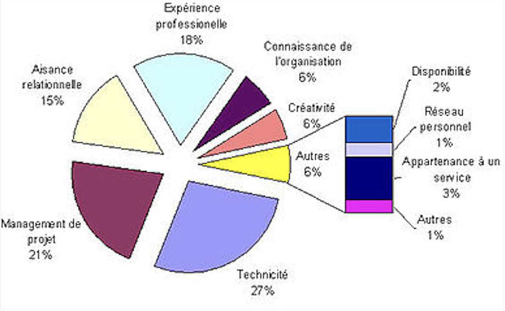

# Chef de projet

*  🔖 **Définition**
*  🔖 **Le métier**
*  🔖 **Les compétences**

___

## 📑 Définition

> Le chef de projet web technique est chargé d’encadrer une équipe de développeurs.

Il **traduit les demandes de son client en solutions informatiques**. Ses missions exigent des compétences techniques et managériales pour accompagner le travail des développeurs. Il élabore le **cahier des charges**, le **planning**, **évalue le temps de travail** et le budget et **sert d'interface** entre les différents acteurs (ingénieurs, techniciens, clients, fournisseurs...). 

Dans une petite structure, où il peut être seul en charge du projet, il est polyvalent et maîtrise toutes les étapes d'un projet. Il est particulièrement **recherché dans les ESN** (entreprises de services du numérique), mais aussi dans les entreprises utilisatrices : banques, grande distribution, industrie automobile, grands groupes ou encore télécommunications.

### 🏷️ **Contexte**

De nombreux intitulés sont disponibles pour ce poste.

* Chef de projet technique
* Responsable technique d’application
* Responsable applicatif
* Chef de projet MOE
* Project leader
* Team leader

La taille du projet dont il a la charge varie selon son expérience. Ainsi, **le chef de projet junior est amené à travailler sur des projets de taille limitée**, le plus souvent interne à un seul département de l'entreprise. 

Il évoluera au fil de sa carrière vers un poste de chef de projet mono-entreprise global, à travers lequel il sera en charge d'un projet s'étendant sur plusieurs sites d'une seule et même entreprise, aux responsabilités plus lourdes.

___

## 📑 Le métier

> Les recrutements de CPI se font par promotion interne.

Ce métier aux multiples facettes est **rarement accessible aux débutants**. Ce poste demande généralement une formation de niveau **bac+3 avec 5 ans d’expérience** sur le terrain, surtout dans le développement voire plus selon la difficulté ou l’ampleur du projet à piloter.

### 🏷️ **Salaires**

Ci-dessous, retrouvez les salaires moyens des chefs de projet informatique en France:

___

## 📑 Les compétences

L'on remarque que différent termes ont été utilisés comme `Agile`, `MOA`, `MOE`, `AMOA` et nous devrions nous interesser à l'évolution de ce métier et aux compétences requises.

> Définition de l'ensemble des phases techniques du projet:

* **Elaborer les spécification**s techniques générales du projet sur la base du cahier des charges (fonctionnel) qui a été fourni par la MOA (maîtrise d’ouvrage), en fonction de l’architecture technique et des exigences en termes de sécurité.
* **Superviser la rédaction** des spécifications (techniques) détaillées du projet.
* **Evaluer les risques** (coûts, délais…) pouvant intervenir au cours de la réalisation.
* **Définir les besoins** en termes de ressources humaines et de compétences techniques.
* **Préparer les éléments de chiffrage** et/ou de facturation.
 
> Pilotage, suivi et coordination du projet

* **Mettre en place les structures** du projet et ses règles de fonctionnement (méthodes, outils de pilotage, indicateurs…).
* **Définir les objectifs** et les délais de réalisation des livrables (applications, modules, développement spécifiques...).
* **Choisir et affecter des ressources**, en fonction des contraintes techniques du projet.
* **Piloter et mesurer** l’état d’avancement (création des tableaux de bord, choix des indicateurs, planification des comités de pilotage, …).
* **Organiser et animer les comités de pilotage** auprès des décideurs.
* **Superviser et coordonner le travail** de l’ensemble des acteurs internes et/ou externes.  
* **Valider** les livrables.

> Test et recette technique

* Planifier et **organiser les tests** unitaires et de charge  
* **Suivre la mise en production** et le déploiement
* **Assurer la correction** des anomalies

