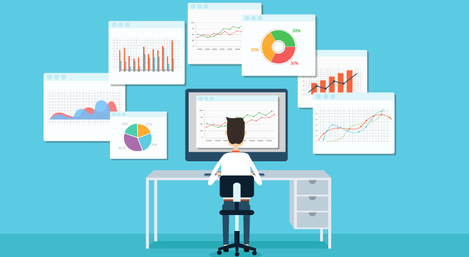
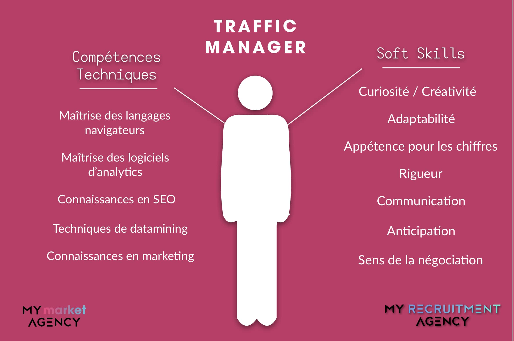

# Traffic manager

*  🔖 **Définition**
*  🔖 **Le métier**
*  🔖 **Les compétences**

___

## 📑 Définition

> Le traffic manager exerce dans des entreprises commercialisant leurs produits ou leurs services sur internet. 

Il a pour mission d’**accroître la rentabilité, la visibilité, l’acquisition de contact et donc les ventes** du site internet. Pour ce faire, il organise la stratégie **web marketing** de l’entreprise pour laquelle il travaille.

C’est lui qui crée les campagnes publicitaires, qui les met en ligne et qui s’occupe de leur gestion ainsi que de leur bon fonctionnement.

### 🏷️ **Contexte**

Il peut travailler en **entreprise** (e-business, e-commerce ou e marketing), en **régie publicitaire** ou en **agence de communication**.

Traffic manager est une spécialisation méconnue et peu d’étudiants décident de se lancer dans cette branche. Résultat, aujourd’hui, les entreprises françaises manquent de professionnels qualifiés et réellement spécialisés dans le domaine du trafic.

___

## 📑 Le métier

Le métier étant relativement récent l’essentiel des traffic managers proviennent d’**écoles supérieures de marketing**, communication ou encore d’informatique. Ces formations étant très généralistes, de plus en plus de trafics managers se forment dans des écoles plus spécialisées. On pourrait citer l’EEMI (Ecole européenne des métiers de l’Internet) ou encore Sup’internet.

Ces écoles directement orientées vers les métiers du digital et du web sont devenues des tremplins très puissants vers les métiers du web marketing et de l’analyse. De nouvelles plateformes en ligne proposent désormais de se former ou de se perfectionner sur des composantes du métier de traffic manager (`Google Analytics` etc). Ces cours sous forme de plusieurs vidéos peuvent être dispensés de manière gratuite. Cependant, certaines plateformes proposent du contenu plus approfondi sous forme d’abonnements à des prix relativement abordables. Une bonne alternative aux écoles spécialisées. 

### 🏷️ **Salaires**

Ci-dessous, retrouvez les salaires moyens des traffic manager en France:

___

## 📑 Les compétences

Toute la journée face à des tableaux de bords comme `Google Analytics` pour être tenu au courant en temps réel des visites et visiteurs sur le site web.

Il s’intéresse à l’audience ramenée sur le site mais aussi à l’origine de cette visite. Il est aussi attentif à toutes les statistiques qui pourraient le renseigner sur la navigation d’un visiteur (taux de rebond, temps passé sur le site).  Le Traffic Manager peut aussi revêtir un costume plus commercial pour mettre en place des stratégies de marketing digital. Il est aussi attentif à la concurrence grâce à une veille quotidienne.
