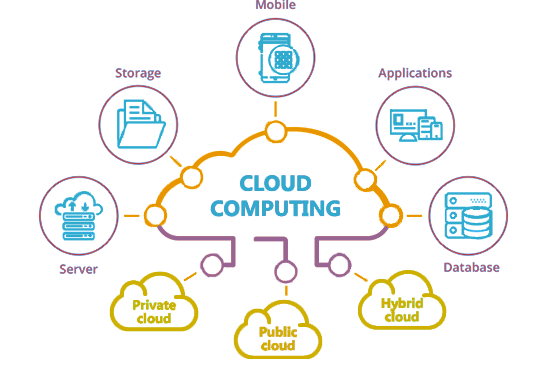
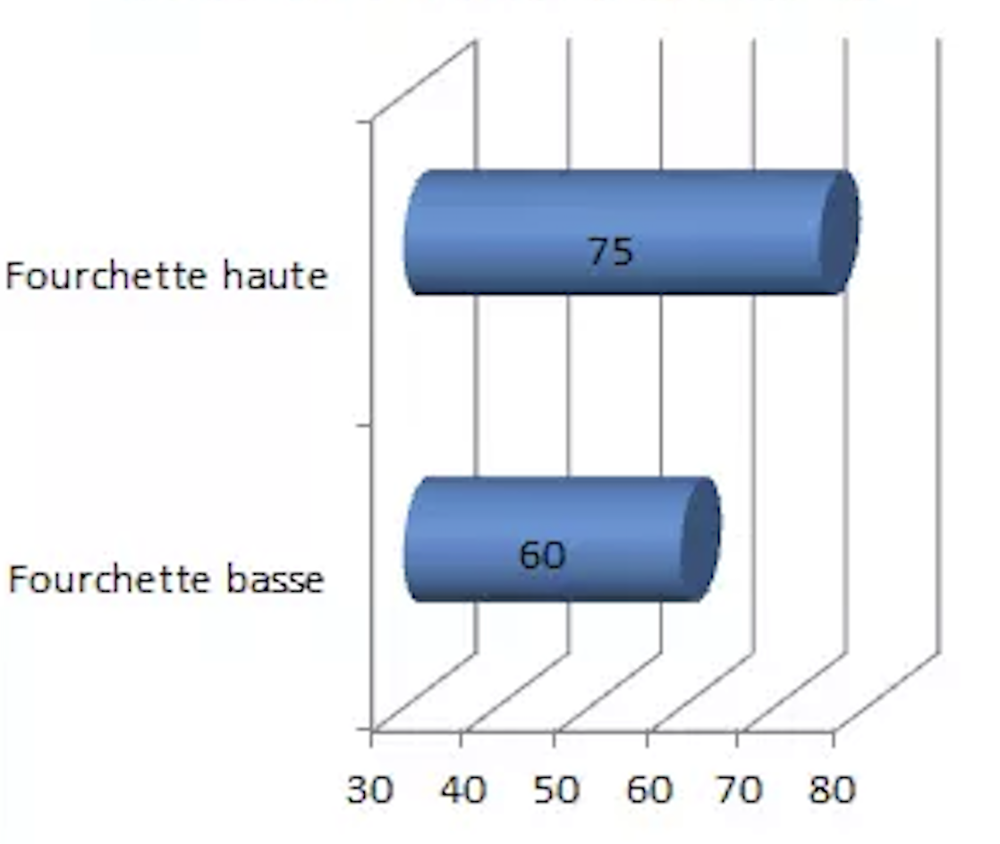

# Cloud computing

*  🔖 **Définition**
*  🔖 **Le métier**
*  🔖 **Les compétences**

___

## 📑 Définition

> Le Cloud Computing est de plus en plus utilisé dans le milieu professionnel.

C’est une manière, pour les entreprises, de **stocker leurs applications et toutes leurs données** sur le web et non plus sur les ordinateurs. Gros avantage : en cas de panne du système, toutes les données sont encore disponibles via internet. Cette nouvelle technologie est de plus en plus prisée par les entreprises : elle permet un stockage plus sécuritaire et correspond à l’air du temps.

### 🏷️ **Contexte**

Les informaticiens spécialisés en Cloud Computing sont très recherchés par les entreprises. Technologie très récente, il en existe peu, mais la demande est grande et risque de croitre de manière importante dans les années à venir.

___

## 📑 Le métier

> Ces professionnels sont pour la plupart des ingénieurs informatique qui ont décidé de se spécialiser dans le développement de l’architecture des réseaux et donc dans le Cloud Computing. 

Pour exercer ce métier, il est recommandé de faire un **bac+5** en école d’ingénieur informatique. Cependant, les écoles d’informatique et les formations universitaires (comme le master informatique par exemple) peuvent être des alternatives efficaces.

### 🏷️ **Salaires**

Ci-dessous, retrouvez les salaires moyens des architectes cloud en France:

___

## 📑 Les compétences

Il veille à la sécurité des données hébergées. Il fait évoluer l’architecture pour qu’elle réponde aux besoins des utilisateurs et assure l’interopérabilité de toute nouvelle solution avec l’environnement existant. Il devra se tenir informé des dernières technologies liées à son domaine, mettre en place les solutions et les superviser. 

Pour mener à bien sa mission, l’architecte cloud devra :

* Collecter le besoin à héberger dans le Cloud (ou à faire évoluer)
* Concevoir la solution à déployer
* Participer au passage à l’exploitation

Un Architecte cloud `AWS` doit avoir une compétence générale du SI, des compétences systèmes Linux et sur la solution d’Amazon.